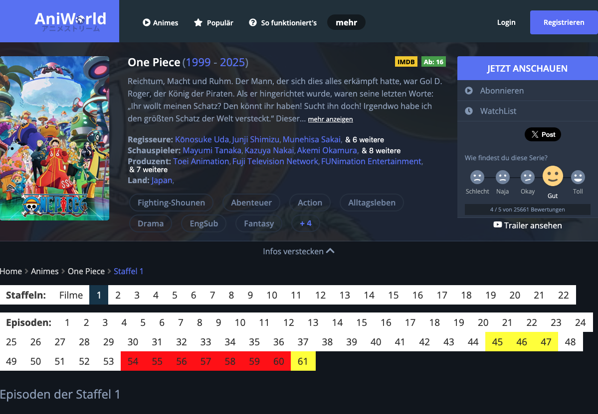

# One Piece Filler Remover


A small weekend browser extension that highlights filler episodes on [aniworld.to](https://aniworld.to/anime/stream/one-piece). Built with Bun + Vite.

## How it works

Fetches the episode list from [animefillerlist.com](https://www.animefillerlist.com/shows/one-piece), caches it locally (24h TTL), and colors episode links accordingly:

| Color | Type |
|-------|------|
| Red | Filler |
| Yellow | Mixed canon/filler |
| None | Canon |

## Stack

- **Manifest V3** browser extension
- **Vite** + `vite-plugin-web-extension` for bundling
- **node-html-parser** for scraping the filler list
- **webextension-polyfill** for cross-browser storage & messaging

## Install (dev)

```bash
bun install
bun run build
```

Load the `dist/` folder as an unpacked extension in `chrome://extensions`.

## Future

- User-configurable colors
- Support for other sites and anime
